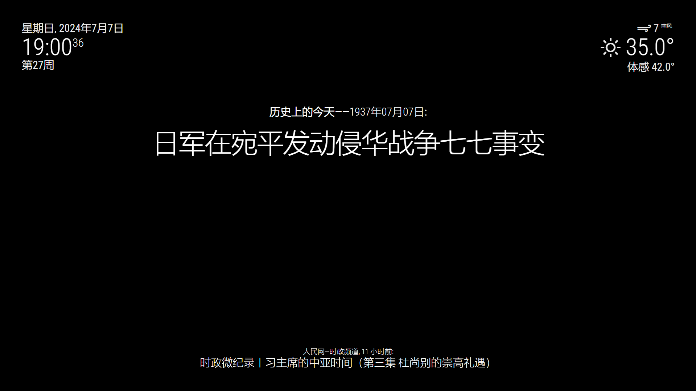

# MMM-TodayinHistory

中文显示历史上的今天，数据来源[https://api.oick.cn/lishi/api.php](https://api.oick.cn/lishi/api.php)。

## 预览


## 安装
运行以下命令：

```shell
cd modules
git clone https://github.com/slacker-HD/MMM-TodayinHistory.git
```
## 使用
在 `config/config.js` 文件中添加如下内容：
```js
var config = {
    modules: [
        {
			module: "MMM-TodayinHistory",
			position: "upper_third",
			config: {
				updateInterval: 15, //以秒为单位更新内容
			},
		},
    ]
}
```